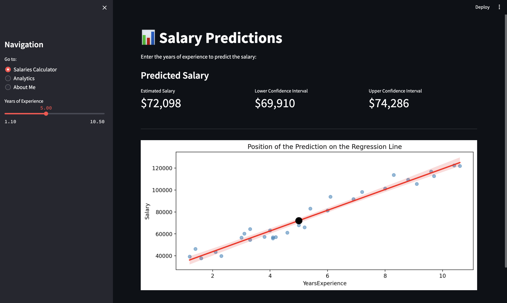
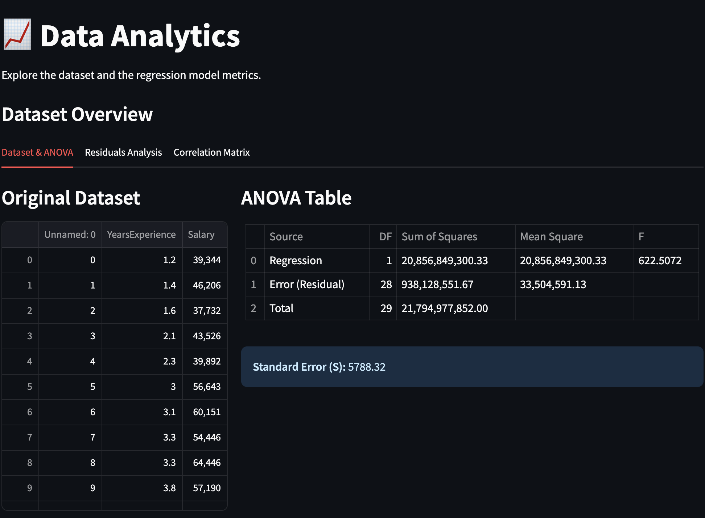

# 📊 Salary Analytics Pro - Interactive Regression Dashboard

This project consists of an interactive application developed in **Streamlit** that implements a **Simple Linear Regression** model to predict salaries based on years of experience. The mathematical and statistical core is developed using the **Object-Oriented Programming (OOP)** paradigm and integrates **Scikit-Learn** for model training and optimization.

Unlike traditional calculators, this system not only provides a point estimate, but also calculates **confidence intervals** (for market averages) and **prediction intervals** (for individual cases), backed by rigorous validation of statistical assumptions.

---

## 🚀 Key Features

* **Decoupled Architecture (OOP):** Complete separation between the mathematical logic (`model.py`) and the graphical interface (`app.py`).
* **Estimates with Uncertainty:** Dynamic calculation of intervals using the *t-Student* distribution.
* **Integrated Research Section:** A tab dedicated to model auditing that includes:
    * Viewing the historical dataset.
    * Generating the **ANOVA table** in real time.
    * Assessing homoscedasticity using residual plots.
    * Testing for normality using a **normal probability plot** based on sample percentiles.

---

## 🛠️ Technologies Used

* **Python 3.12+**
* **Streamlit** (UI/UX Design)
* **Scikit-Learn** (Linear model fitting)
* **SciPy & Math** (Statistical distributions and confidence interval calculation)
* **Pandas & NumPy** (Data manipulation and structuring)
* **Matplotlib & Seaborn** (Rendering statistical graphs)

---

## 📂 Project Architecture

```text
simple_linear_regression/
│
├── app/
│   ├── app.py             # Streamlit user interface and navigation layout
│   └── model.py           # LinearRegressionModel OOP class (Statistical engine)
│
├── data/
│   └── data.txt           # txt to download the clean data
│
│
├── investigation/
│   └── linear_regression.ipynb  # Initial exploratory data analysis and model training
│
├── .gitignore             # Specifies intentionally untracked files to ignore
└── README.md              # Project documentation and setup guide
```

---

## 💻 Getting Started: Installation and Setup

Follow these steps to clone the repository, install the required environment dependencies, and run the Streamlit dashboard application locally.

### 1. Clone the Repository
Open your terminal and run the following commands to clone this project and navigate into the root directory:
```bash
git clone https://github.com/manereyes/simple_linear_regression.git
cd simple_linear_regression
```

### 2. Set Up Your Environment
It is highly recommended to use a virtual environment (such as the env/ directory specified in the project layout) to keep your global Python dependencies clean.

**On macOS/Linux:**

```bash
python3 -m venv env
source env/bin/activate
```

**On Windows:**
```bash
python -m venv env
env\Scripts\activate
```

### 3. Install Dependencies
Install all the mandatory libraries required to compute the statistical engine and render the interactive data visualizations:

```bash
pip install streamlit scikit-learn scipy pandas numpy matplotlib seaborn
```

### 4. Run the Streamlit Application
Since the core frontend script is located inside the `app/` directory, execute the following command from the root of your project to launch the dashboard:

```bash
streamlit run app/app.py
```

Once executed, a local web server will spin up, and the application will automatically open in your default browser at `http://localhost:8501` .

---

## 📱 Application Design and Usage

The dashboard is split into two logical views accessible via the sidebar navigation. Below is a breakdown of the layout and functionality of each page, along with placeholders where you can view the live interface.

### 1. Salary Prediction Calculator (`Calculadora de Salarios`)
This is the consumer-facing interface. It allows users to input their professional experience and instantly receive structured, risk-adjusted salary insights.

* **Sidebar Slider:** A dynamic input control strictly bounded between **1.1 and 10.5 years of experience** to prevent statistical extrapolation outside our validated sample range.
* **Key Performance Metrics (KPIs):** Displays the exact **Point Estimate** alongside the precise lower and upper boundaries of the **Individual Prediction Interval** (calibrated at a 95% confidence level).
* **Interactive Regression Plot:** Visualizes where the user's specific query drops onto the trained regression line relative to the underlying historical scatter plot.

#### Interface Preview:


---

### 2. Analytical Investigation and Validation (`Investigación Detallada`)
This view serves as an audit panel to prove the model's validity, demonstrating that the errors satisfy the Gauss-Markov assumptions before executing any deployment.

It is structured into three dedicated tabs for systematic navigation:
* **Dataset & ANOVA Tab:** Displays the original tabular historical data side-by-side with a dynamically reconstructed **ANOVA Table** (detailing Degrees of Freedom, Sum of Squares, Mean Squares, and the overall $F$-statistic).
* **Residual Analysis Tab:** Contains the **Residuals vs. Fitted Plot** to audit homoscedasticity and independent errors, alongside our custom **Normal Probability Plot** to visually verify error normality.
* **Correlation Tab:** Renders a clean Seaborn heatmap matrix confirming the strength of the linear relationship between the features.

#### Interface Preview:
